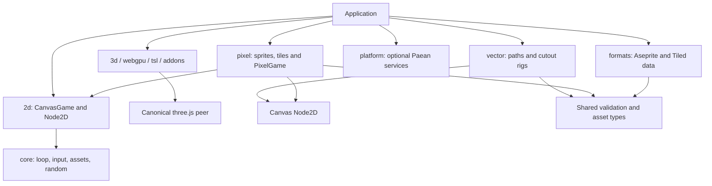

# Architecture

Paean JS has independent 3D, Canvas vector, and Canvas pixel entry points. Applications choose their visual backend explicitly. Pure 2D applications do not install or load three.js. Vector and pixel modules share only a small Canvas transform/runtime layer and renderer-independent data contracts; neither imports the other. Platform services are a separate opt-in dependency.

The repository preserves three.js history and its unmodified source tree. Paean game APIs and the upstream renderer revision have independent version axes. Updating three.js does not require changing Canvas 2D implementations or their asset definitions.

## Dependency direction

`/3d/vector` and `/3d/pixel` are optional adapters for native three.js scenes. They require three.js and retain the 0.1 `VectorShape`, `Skeleton2D`, `PixelAtlas`, `PixelSprite`, `TileMap`, and `Game2D` APIs. The root and `/game` entries remain compatibility aggregates; importing them intentionally loads the original combined game graph. New applications should use selective entries.

## Package and loading boundaries

| Entry after `@paean-ai/paean-js` | Runtime contents | Needs three.js? |
| --- | --- | --- |
| `/core` | Fixed steps, input, asset ownership, random, SDK version | No |
| `/2d` | CanvasGame, Node2D and transform types | No |
| `/vector` | VectorPath, Rig2D; no game loop or pixel code | No |
| `/pixel` | PixelGame, sheets, sprites, frame animation, tile layers, grid collision | No |
| `/formats` | Aseprite/Tiled data conversion and shared asset types | No |
| `/platform` | Optional Paean/8x adapter | No |
| `/3d` | Exact upstream `three` namespace, no Paean game imports | Yes |
| `/webgpu`, `/tsl`, `/addons/*`, `/src/*` | Canonical upstream exports and aliases | Yes |
| `/3d/vector`, `/3d/pixel`, `/vector-svg` | Optional native-three 2D adapters | Yes |
| Root, `/game` | Original compatibility aggregates | Yes |

A single npm distribution provides multiple entry points; this is load-time and runtime-dependency separation, not separate npm package downloads. The tarball still contains optional adapters, declarations, source maps, and upstream forwarding files. Loading `/pixel` does not fetch those files. `three` and `@types/three` are optional peers, with exact supported versions when used. They are development dependencies in this repository so compatibility tests and proxy generation remain reproducible.

ESM modules retain explicit relative dependencies and do not depend on tree shaking for isolation. CommonJS preserves one module per source file, so combining subpaths shares constructor identity without evaluating an aggregate. Prebuilt `dist/bundles/{2d,vector,pixel,core,platform,formats,3d}.js` files use shared hashed chunks. Deploy the complete `dist/bundles` directory and import only the chosen entries; the browser fetches only reachable chunks. Keep these chunks together from one build. Upstream three.js remains external to every build.

The root entry is retained for source compatibility. It does not re-export the new Canvas APIs: mixing two scene graphs behind similar names would hide the backend boundary. `Node2D` and `three.Object3D` are distinct types. Choose `/3d/vector` and `/3d/pixel` for objects that must participate in native three.js scenes, depth, lighting, or projection. Canvas vector shapes and Canvas pixel sprites can share one `Node2D` scene or rig by explicitly importing both modules.

## Rendering and resource ownership

`CanvasGame` owns its Canvas 2D context usage, input listeners, fixed-step loop, and registered assets. It never imports vector, pixel, platform, or three.js code. `PixelGame` specializes framebuffer sizing and sampling. Vector mode maintains a logical world with a display-density framebuffer; pixel mode maintains a fixed logical framebuffer and integer CSS enlargement, shrinking fractionally only on small displays.

`Node2D` provides transforms, parent/child relationships, visibility, opacity, and sibling painter order. It uses seconds, radians, and Y-up coordinates. `Rig2D` uses the shared skeleton definition, samples numeric keyframes, and changes complete attachment sets without changing the current bone pose. Slot order is global within each rig. Fade transitions blend from the current pose into the advancing new clip. Native `Skeleton2D` continues to use three.js Bone, AnimationClip and AnimationMixer.

`VectorPath` draws Canvas Path2D fills/strokes. `SpriteSheet` refers to a decoded, caller-owned Canvas image source. `Sprite2D` and `TileLayer` preserve top-down image/serialized row conventions inside a Y-up world. `FrameAnimator` uses a structural frame target shared with the native-three `SpriteAnimator` adapter. `GridCollision` uses local AABBs and a bottom-up solid-cell callback. Data conversion in `/formats` creates no renderer, texture, DOM parser, or image loader.

A Canvas game does not recursively dispose caller-owned scene attachments or close source images. Register an object implementing `dispose()` through `assets.load(key, loader)` for explicit ownership, or dispose those resources yourself. A closable ImageBitmap needs an application-owned wrapper whose `dispose()` calls `close()`; pass `false` as the third argument to `load` for borrowed resources. `Rig2D.dispose()` releases skin/animation references and detaches attachments. Native-three shapes, sprites and tilemaps retain geometry/material ownership; atlases own cloned samplers while source textures remain caller-owned.

## Repository ownership

| Location | Owner and purpose |
| --- | --- |
| `src`, `build`, `examples`, `test`, `utils`, other protected paths | Unmodified upstream three.js |
| Root `package.json` and lockfile | Original upstream development environment |
| `packages/paean-js/src/canvas*` | Renderer-independent Canvas backend and visual modules |
| `packages/paean-js/src/core`, `animation`, `formats`, `platform` | Composable game/runtime/data services; legacy Game2D is reached only through native-three entries |
| `packages/paean-js/src/two`, `pixel` | Native-three compatibility adapters |
| `packages/paean-js/examples`, `test` | Runnable applications and behavioral/dependency verification |
| `paean/upstream.json`, `scripts/paean` | Renderer provenance, ownership, and synchronization |
| `paean/docs`, `paean/api.json`, `llms.txt` | Human and model-readable contract |

## Regression checks

CI walks unbundled imports and prebuilt bundle source maps to reject cross-family dependencies and any three.js dependency in pure 2D modules. It bundles complete entry namespaces with transfer budgets, installs a tarball without either three.js peer, checks ESM/CommonJS composition and strict TypeScript consumers, and renders Canvas examples with WebGL blocked. Separate tests require `/3d` to equal the entire upstream namespace by strict identity and verify that the 3D example requests no Paean visual modules.

The stable upstream sync updates only renderer-owned trees, optional renderer/type peer pins, development copies, compatibility proxies, and provenance. Its full validation includes these same module-boundary checks. See [upstream maintenance](upstream.md), [modular usage and migration](modules.md), and [validation records](validation.md).
